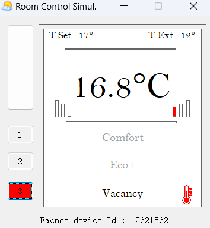

# Simple BACnet in and MQTT out and Modbus-to-MQTT bridge demo

This guide covers how to set up a simple BACnet-IP in and MQTT out demo on the WisGate Connect (RAK7391), as well as a simple Modbus-to-MQTT bridge example. Both demos are based on Node-RED flows for easy deployment and configurations. 

## Hardware preparation

You will need a PC running the YABE BACnet room control simulator or a real BACnet device, and a WisGate Connect gateway (RAK7391). Make sure your PC/BACnet device and the WisGate Connect are in the same LAN, and both of them have the ethernet cable plugged in. The network topology is shown below:


If you want to test out the Modbus-to-MQTT bridge, you will need a RAK4631 + RAK1901（temperature and humidity sensor), and two RAK5802 (Modbus) modules. Check the figure below to see how to connect the WisGate Connect to a Modbus device(RAK4631+RAK1901).


## Software preparation

The software set-up for these two use cases is different, thus we will cover them in two parts. You need to download the repo to you WisGate Connect first, please use the command below:

```
git clone https://github.com/Sheng2216/bacnet-to-mqtt-modbus-to-mqtt.git
```

#### 1. BACnet in and MQTT out

If you are using a real BACnet device, you can skip to the WisGate connect setup section, otherwise you need to set up both the PC and WisGate Connect.

###### PC set-up

For the software side, you need to install YABE on your PC first, please check this link: [Yet Another Bacnet Explorer download | SourceForge.net](https://sourceforge.net/projects/yetanotherbacnetexplorer/)). After the installation is finished, please navigate to the install folder of YABE, you should be able to see a folder called **AddOn**, and there is an application called **BACnet.Room.Simulator** in the folder. Double-click on this application to start the simulator.


The simulator has an interface, and it looks like this:



###### WisGate Connect set-up

1. Clone this repo

2. Enter the directory and run `./start.sh` to start the demo.
   
   You should be able to see the URLs after deployment is finished:
   
   

3. Browse to Node-RED's URL to visit the web interface
   
   
   
   You will find two Node-RED flows, one is a Modbus to MQTT bridge demo, and the other one is a BACnet-in & MQTT-out demo. Notice that the second flow is disabled for now, if you want to enable both flows, please follow the instructions below.
   
   
   
   after the BACnet-in & MQTT out is enabled, you will be able to deploy the flow.
   
   
   
   After that, you need to use the ”Who is“ command to detect all the BACnet devices in the subnet first, and then configure the other **read node** in cyan to read from the BACnet device. Please check the [demo video](assets/Deploy a simple BACnet to MQTT bridge demo on WisGate Connect_EN_1.mp4). Notice that this flow shares the same MQTT broker with the Modbus-to-MQTT bridge flow, so you might want to make sure the other flow is enabled, unless you created another MQTT broker.

4. (Optional) If you want to check the data received by the MQTT broker, please check Grafana's web interface to configure the data source and create a new panel.

#### 2. Modbus-to-MQTT bridge

The default node-red flow enabled in the Node-RED container we created is the Modbus-to-MQTT bridge. In this example, the Wisblock sensor we provided can send temperature and humidity data to WisGate Connect periodically or upon request via Modbus protocol. The Node-RED flow will convert the data we received, and then publish it to an MQTT broker.

The code running on the Wisblock sensor is saved in this repo as well, please check the code [here]([bacnet-to-mqtt-modbus-to-mqtt/rak5802_modbus.ino at main · Sheng2216/bacnet-to-mqtt-modbus-to-mqtt · GitHub](https://github.com/Sheng2216/bacnet-to-mqtt-modbus-to-mqtt/blob/main/rak5802_modbus_device/rak5802_modbus.ino)). 

After the Node-RED flow is deployed, you can click on the timestamp icon to trigger the output, and you should be able to see the temperature and humidity data have been published to the MQTT broker in the debug console.


